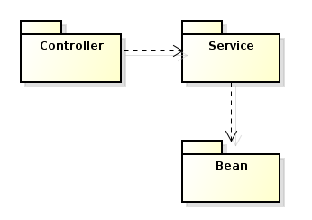
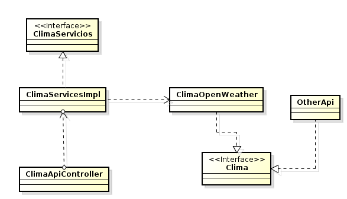
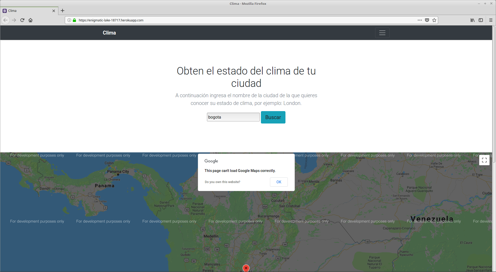

# ARSW - 2 Parcial
## Jonathan Prieto
### Aplicación en Heroku
 - [Link no disponible, correr localmente]()
---
#### Descripción arquitectura
La siguiente aplicación expone un servicio que permite al usuario obtener el estado del clima de una ciudad dada por el mismo.

- La arquitectura principal se fundamenta en MVC.

- Como se puede ver en la imágen anterior, hay un controlador que se encarga de gestionar los servicios que ofrece una Api (ClimaOpenWeather) por medio de inyección de dependencias. Además hay una interfaz clima a la que se podrían implementar otras Apis, permitiendo que la aplicación se pueda escalar, extender y no depender de una en caso que esta falle. para esto se puede usar Inversión de control, para que al momento de consultar la ciudad también se pueda seleccionar la Api que se desea usar.

- Por el lado de la vista, y como se puede apreciar en la imágen anterior, se usa una página de inicio en la que se puede hacer uso del servicio antes descrito.

Por último faltó implementar unas pruebas, pero éstas se podrían hacer generando un pool de hilos con la interfaz executor y runnable.
